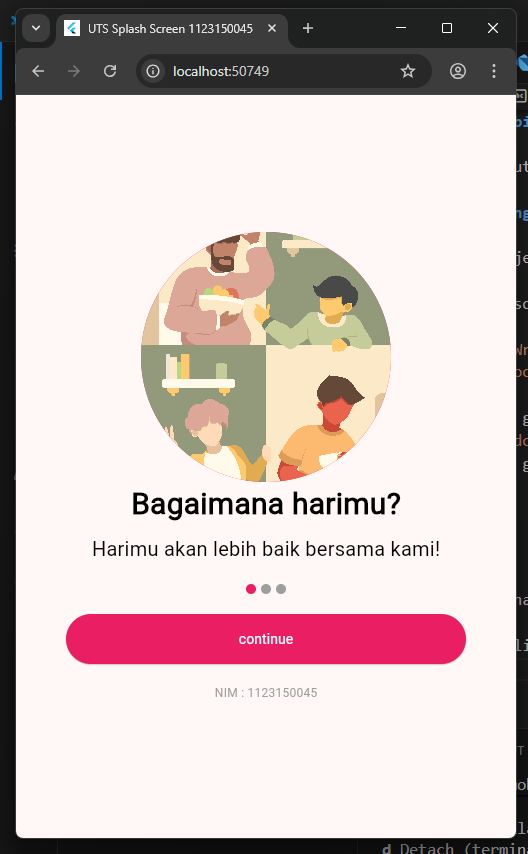
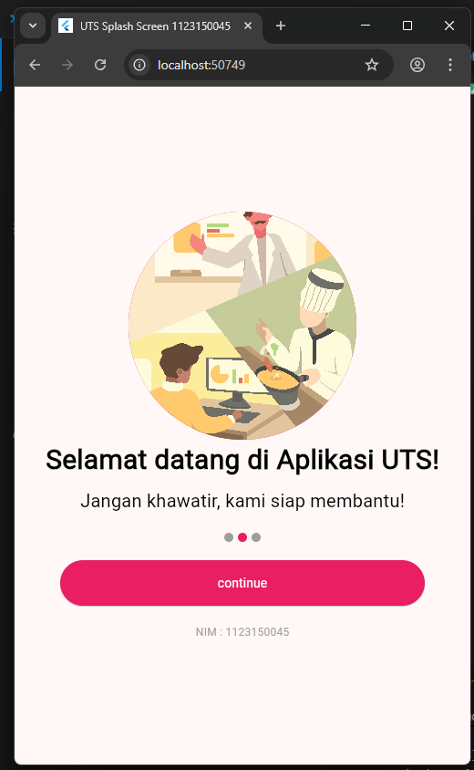
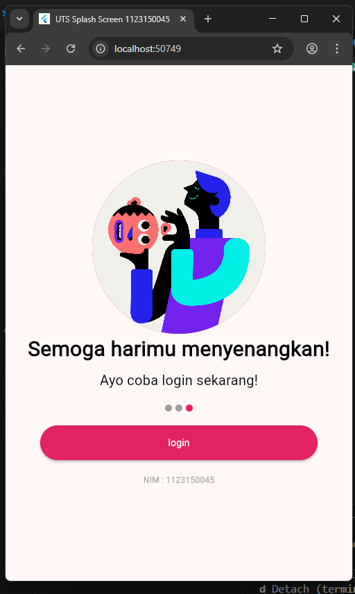
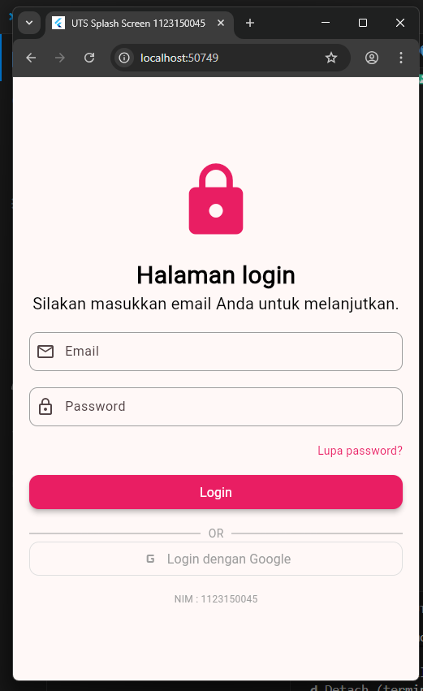
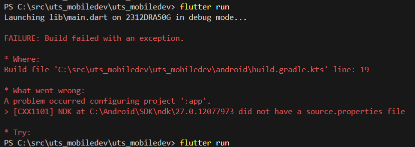

# uts_mobiledev

A new Flutter project.

## Getting Started

This project is a starting point for a Flutter application.

A few resources to get you started if this is your first Flutter project:

- [Lab: Write your first Flutter app](https://docs.flutter.dev/get-started/codelab)
- [Cookbook: Useful Flutter samples](https://docs.flutter.dev/cookbook)

For help getting started with Flutter development, view the
[online documentation](https://docs.flutter.dev/), which offers tutorials,
samples, guidance on mobile development, and a full API reference.

~~~~~~~~~~~~~~~~~~~~~~~~~~~~~~~UTS MOBILE DEV~~~~~~~~~~~~~~~~~~~~~~~~~~~~~~~~~~

Nama        : Dzidan Rafi Habibie
Kelas       : TI SE 23 M
NIM         : 1123150045
Kode warna  : PINK

Hasil aplikasi :
hasil splash screen 1

hasil splash screen 2

hasil splash screen 3

hasil login screen

Cara menjalankan project :
1. buka terminal bawaan vs code
2. lalu ketik saja flutter run
3. akan disuruh pilih mau di mana dijalankannya, pilih saja dijalankan di Chrome
4. aplikasi akan berjalan semestinya

Kendala :
1. saya masih belum bisa menjalankan aplikasi yang dibuat ini di hp android saya, jika dijalankan akan ada keterangan seperti di bawah ini
